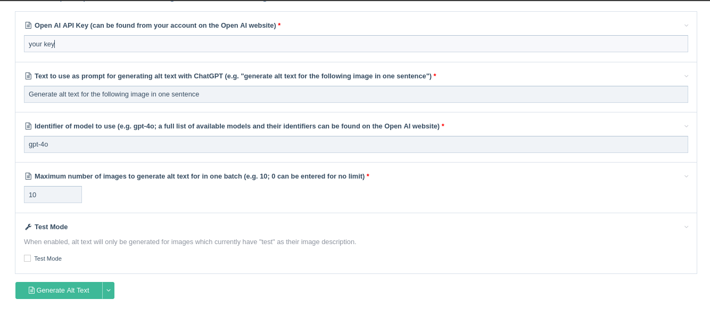

# AltTextGpt for ProcessWire

This ProcessWire module, AltTextGPT, is an interface for generating alt text for
all of the images in your website, using the ChatGPT Open AI API.

Using the API requires an account with the Open AI API and costs money, although its
pay-what-you-use and the charges are minimal. For example, alt text was generated for 200 images,
using 94 cents of Open AI Credits. You can create an account with Open AI,
from <a href='https://openai.com/'>this link</a>, and then once you have an API key,
you can enter it below, or configure it as a permanent setting for this module via Modules->Configure->AltTextGpt.

After configuring the API key as described above, you can then use the form below
to generate alt text for images in the site. The module will attempt to generate alt txt
for every image that currently has no alt text, one at a time. Generating alt text takes a few seconds
for each image, so this is not an instantaneous process. For this reason, if you have many images,
we suggest generating alt text for the images in batches. You can also set a batch size below,
generating alt text for 10 or 20 images at a time, and then repeating the process, until
you have generated alt text for all of the images in the site. After each run,
the table above should show that there are fewer images without alt text in the site,
until eventually the table indicates that there are 0 images in the site without alt text.

Note, for alt text to show up for images uploaded in the body of a CKEditor field,
this configuration must be set for that field as described in <a href='https://processwire.com/talk/topic/25641-how-do-i-fill-body-field-image-alt/?do=findComment&comment=214548'>this comment</a>.
                

## How to install this module

1. Copy all of the module files to `/site/modules/AltTextGpt/`.

2. In your admin, go to Modules > Refresh. 

3. Click “Install” for the “AltTextGpt” module (on the “Site” tab). 

